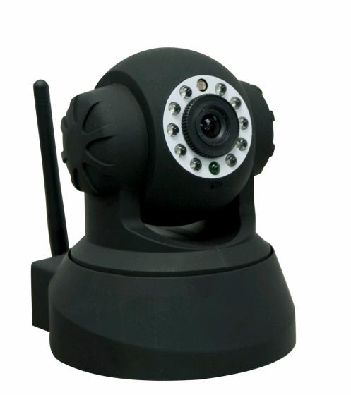

# IPCameraCGI
IP Camera component for older IP camera's for Home Assistant


---
Instructions on how to integrate Foscam IP cameras within Home Assistant.

The `ipcameracgi` platform allows you to watch the live stream of your IP Camera in Home Assistant. Also, if your IP camera supports pan/tilt, you can control it in Home Assistant.

The IP camera should support cgi commands such as videostream.cgi, decoder_control.cgi and snapshot.cgi. Full documentation about the IP Camera CGI functions can be found in [this](ipcam_cgi_sdk.pdf) pdf file.

## Configuration

To enable your Foscam IP camera in your installation, add the following to your `configuration.yaml` file:

```yaml
# Example configuration.yaml entry
camera:
  - platform: ipcameracgi
    ip: IP_ADDRESS
    username: YOUR_USERNAME
    password: YOUR_PASSWORD
```


ip:
  description: The IP address your camera.
  required: true
  type: string
port:
  description: The port that the camera is running on.
  required: false
  default: 88
  type: integer
rtsp_port:
  description: The port that the camera uses for RTSP. This is normally auto-discovered but some models may need this set, such as the R2 and R2C.
  required: false
  default: None
  type: integer
username:
  description: The username for accessing your camera.
  required: true
  type: string
password:
  description: The password for accessing your camera.
  required: true
  type: string
name:
  description: This parameter allows you to override the name of your camera.
  required: false
  type: string


### Service `foscam.ptz`

If your IP camera supports PTZ, you will be able to pan or tilt your camera.

| Service data attribute | Description |
| -----------------------| ----------- |
| `entity_id` | String or list of strings that point at `entity_id`s of cameras. Use `entity_id: all` to target all. |
| `movement` | 	Direction of the movement. Allowed values: `up`, `down`, `left`, `right`, `top_left`, `top_right`, `bottom_left`, `bottom_right` |
| `travel_time` | (Optional) Travel time in seconds. Allowed values: float from 0 to 1. Default: 0.125 |

### Example card with controls

<p class='img'>
  
  Example showing an IP camera with controls for Pan and Tilt.
</p>


Using the following card code you can achieve a card displaying the live video feed from a Foscam camera with controls for moving the camera at the bottom right corner.

```yaml
type: picture-elements
entity: camera.bedroom
camera_image: camera.bedroom
camera_view: live
elements:
  - type: icon
    icon: 'mdi:arrow-up'
    style:
      background: 'rgba(255, 255, 255, 0.5)'
      right: 25px
      bottom: 50px
    tap_action:
      action: call-service
      service: ipcameracgi.ptz
      service_data:
        entity_id: camera.bedroom
        movement: up
  - type: icon
    icon: 'mdi:arrow-down'
    style:
      background: 'rgba(255, 255, 255, 0.5)'
      right: 25px
      bottom: 0px
    tap_action:
      action: call-service
      service: ipcameracgi.ptz
      service_data:
        entity_id: camera.bedroom
        movement: down
  - type: icon
    icon: 'mdi:arrow-left'
    style:
      background: 'rgba(255, 255, 255, 0.5)'
      right: 50px
      bottom: 25px
    tap_action:
      action: call-service
      service: ipcameracgi.ptz
      service_data:
        entity_id: camera.bedroom
        movement: left
  - type: icon
    icon: 'mdi:arrow-right'
    style:
      background: 'rgba(255, 255, 255, 0.5)'
      right: 0px
      bottom: 25px
    tap_action:
      action: call-service
      service: ipcameracgi.ptz
      service_data:
        entity_id: camera.bedroom
        movement: right
  - type: icon
    icon: 'mdi:arrow-top-left'
    style:
      background: 'rgba(255, 255, 255, 0.5)'
      right: 50px
      bottom: 50px
    tap_action:
      action: call-service
      service: ipcameracgi.ptz
      service_data:
        entity_id: camera.bedroom
        movement: top_left
  - type: icon
    icon: 'mdi:arrow-top-right'
    style:
      background: 'rgba(255, 255, 255, 0.5)'
      right: 0px
      bottom: 50px
    tap_action:
      action: call-service
      service: ipcameracgi.ptz
      service_data:
        entity_id: camera.bedroom
        movement: top_right
  - type: icon
    icon: 'mdi:arrow-bottom-left'
    style:
      background: 'rgba(255, 255, 255, 0.5)'
      right: 50px
      bottom: 0px
    tap_action:
      action: call-service
      service: ipcameracgi.ptz
      service_data:
        entity_id: camera.bedroom
        movement: bottom_left
  - type: icon
    icon: 'mdi:arrow-bottom-right'
    style:
      background: 'rgba(255, 255, 255, 0.5)'
      right: 0px
      bottom: 0px
    tap_action:
      action: call-service
      service: ipcameracgi.ptz
      service_data:
        entity_id: camera.bedroom
        movement: bottom_right
```

### Extra CGI Commands

These IP Webcams support CGI Commands and can be controlled by Home Assistant ([Source](http://www.ipcamcontrol.net/files/Foscam%20IPCamera%20CGI%20User%20Guide-V1.0.4.pdf)). For an example of how this can be done, see the [Foscam IP Camera Pan, Tilt, Zoom Control](/cookbook/foscam_away_mode_PTZ/) Cookbook entry.
